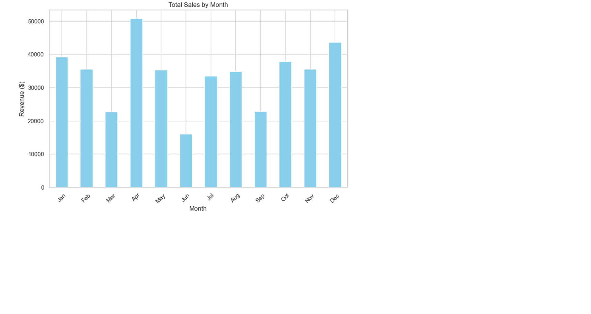
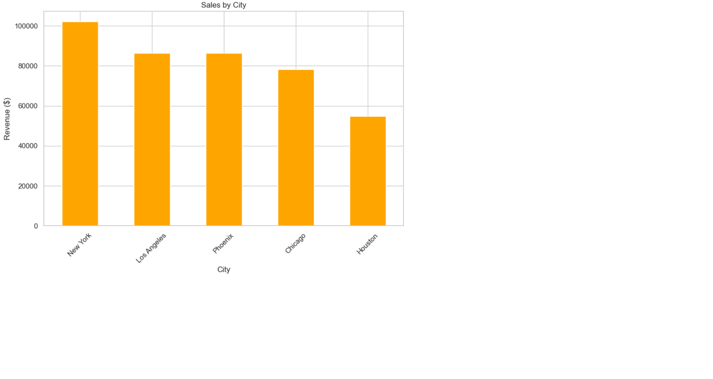

# 📊 Sales Data Analysis

This project explores one year of fictional retail sales data for a company. Using Python and Jupyter Notebook, the goal is to uncover business insights through data cleaning, exploration, and visualization.

## 📁 Dataset

The dataset (`sales_data.csv`) contains 200 fictional sales records from various cities in 2023.

**Columns include:**
- `Order ID`
- `Product`
- `Quantity Ordered`
- `Price Each`
- `City`
- `Order Date`
- `Month` (generated)
- `Sales` (calculated)

## 🛠 Tools & Libraries

- Python 3
- Jupyter Notebook
- Pandas
- Matplotlib
- Seaborn

## 📈 Key Insights

- **Sales by Month** – Highlights revenue trends across the year
- **Top Cities** – Compares performance between different locations
- **Best-Selling Products** – Shows which products generated the most revenue

## 🧪 How to Use

1. Download or clone this repository
2. Open `sales_analysis.ipynb` in Jupyter Notebook
3. Run the cells step-by-step to see the analysis and charts

## 🔗 Live Preview (Optional)

> If you upload screenshots of charts, add them here:

## 📬 Contact

Made by **Amjad Salih**  
📧 amgadnazar11@gmail.com  
🔗 [LinkedIn](https://www.linkedin.com/in/amjad-nazar)
